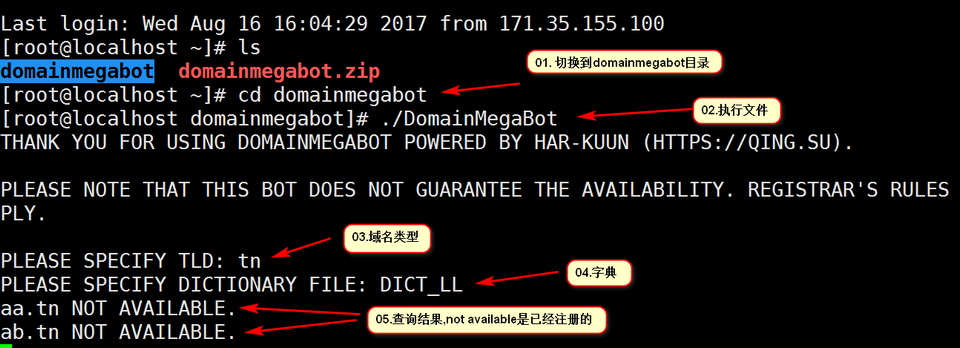

- domainmegabot----域名未注册扫描软件

下载:wget -c --no-check-certificate https://raw.githubusercontent.com/bashstore/softstore/master/domainmegabot.zip

安装使用方法:

首先需要gcc的支持.所以需要先安装:

    yum -y install gcc zip c++
	unzip domainmegabot.zip
	cd domainmegabot
	gcc -o DomainMegaBot DomainMegaBot.c
	./DomainMegaBot

使用方法:

